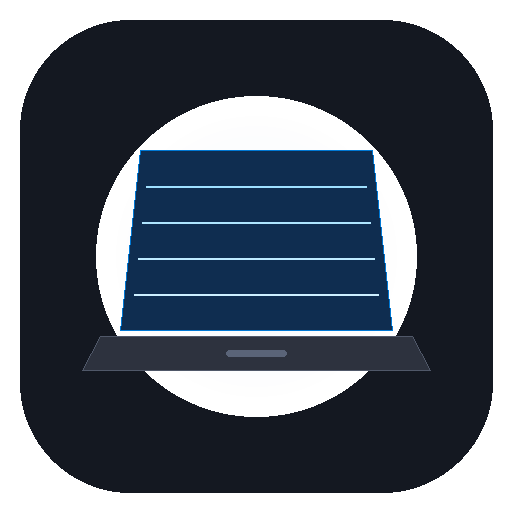

# Hinge (for Windows)

Give your Windows laptop desktop a little bend. Close the lid and watch your screen softly fold and blur. Open it and everything comes back.



## For the nerds

Hinge samples lid angle in real time and transforms it into a smooth, continuous desktop fold:
- **Motion Math**: A critically damped second-order filter with angular velocity estimation (60 ms time constant), $0.6^\circ$ noise deadband, and lookahead prediction smooths out integer degree steps into silky 60 FPS motion.
- **GPU Shaders**: WebGL 2.0 renders homogeneous horizontal perspective taper, multi-level progressive Gaussian blur (soft 6px, medium 16px, broad 36px), top corner vignette shading, and edge feathering matching the original Metal shader.
- **Click-Through Overlay**: Runs in an always-on-top transparent overlay window with input click-through, ensuring you can interact with all your desktop windows seamlessly.
- **Local & Private**: All screen capture frames stay entirely in GPU memory on your PC. No recordings, no telemetry, no uploads.

## Windows Sensor Support

1. **Hardware Hinge Sensors**: Supports native Windows 10/11 WinRT `Windows.Devices.Sensors.HingeAngleSensor` and USB HID (`0x0020`/`0x008A`) on convertibles and 2-in-1 laptops (Surface Laptop Studio, Lenovo Yoga, HP Spectre, Dell 2-in-1, Asus Zenbook Flip, etc.).
2. **Virtual / Interactive Lid Mode**: Standard laptops without continuous hinge angle sensors can use:
   - **Interactive Slider**: Test and tune any lid angle from 15° to 180° in Settings.
   - **Test Lid Bend**: Click the "Test Lid Bend" button in Settings or Tray for an instant 3-second animated fold demo.
   - **Global Shortcuts**: Press <kbd>Ctrl</kbd>+<kbd>Shift</kbd>+<kbd>[</kbd> to bend the screen and <kbd>Ctrl</kbd>+<kbd>Shift</kbd>+<kbd>]</kbd> to open.

## Requirements

- Windows 10 (Version 2004+) or Windows 11 (64-bit)
- Node.js v18+ (tested on Node.js v24)

## Getting Started

Clone the repository and run:

```bash
git clone https://github.com/<your-username>/hinge-windows.git
cd hinge-windows
npm install
npm start
```

## Running Tests

Run the unit test suite verifying the `LidMotion` filter, noise deadband, baseline calibration, and velocity estimation:

```bash
npm test
```

## Usage

1. Open Hinge from the system tray or start menu.
2. Click **Turn on** or toggle the switch in Settings.
3. Open your laptop to your comfortable viewing angle and click **Set open position** (default is 100°).
4. Fold your lid down or press <kbd>Ctrl</kbd>+<kbd>Shift</kbd>+<kbd>[</kbd> / click **Test Lid Bend** to experience the fold!

## License

MIT License. See [LICENSE](LICENSE) for details.
